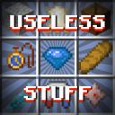

# Alexanders-Useless-Stuff

This is my first mod and it adds many useless items and features!

## Features
[Showcase Video](https://youtube.com/null)

### General
- **Zoom**\
The mod adds a keybinding which while held sets the player's FOV to 30.

### Items
- **Sapphire**\
A blue gem.
- **Parchment**\
A leather and paper mix. You can write text on it when right-clicking.
- **Pocket Watch**\
A smaller clock. Displays the current in-game time when right-clicking.
- **Baguette**\
A long _french_ bread. Gives you 6 hunger units (x3). Has an attack damage of 6 (x3).
- **Feather of Jumping**\
A fancy blue feather. Gives you an upwards velocity of 1.0 when right-clicking. Has a cooldown of 40 ticks after right-clicking.
- **Magnet**\
Pulls nearby items into your inventory when holding it in your hand or off-hand.
- **Nether Core**\
A red Nether Star. Basically runs the `/fill ~10 ~10 ~10 ~-10 ~-10 ~-10 minecraft:netherrack`, except it doesn't replace air when right-clicking on a block.
### Blocks
- **Crate**\
A wooden box. You cannot store items in it, because it is purely decorational.
- **Block of Feathers**\
A white block similar to a wool block. Purely decorational.
### Crafting Recipes
View all 3 shapeless and 6 shaped recipes in the video.